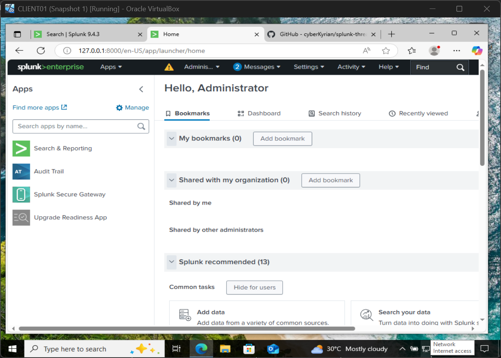
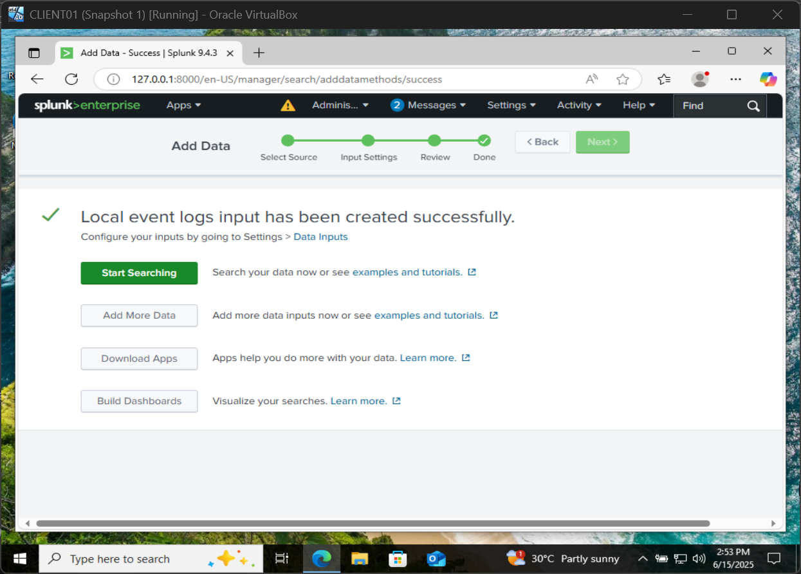
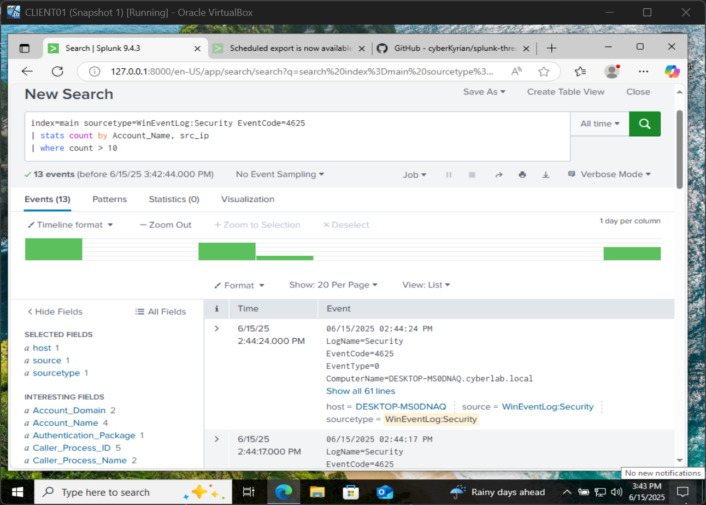
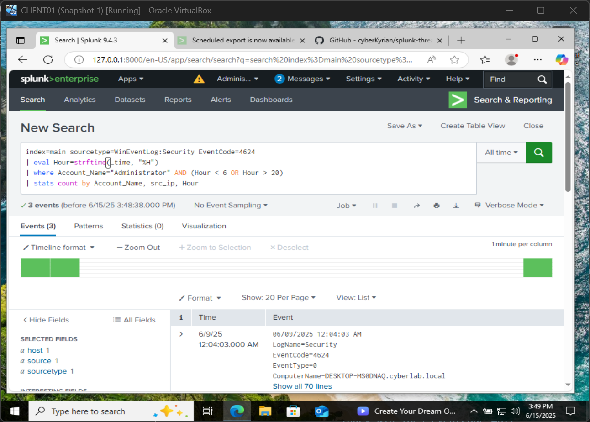
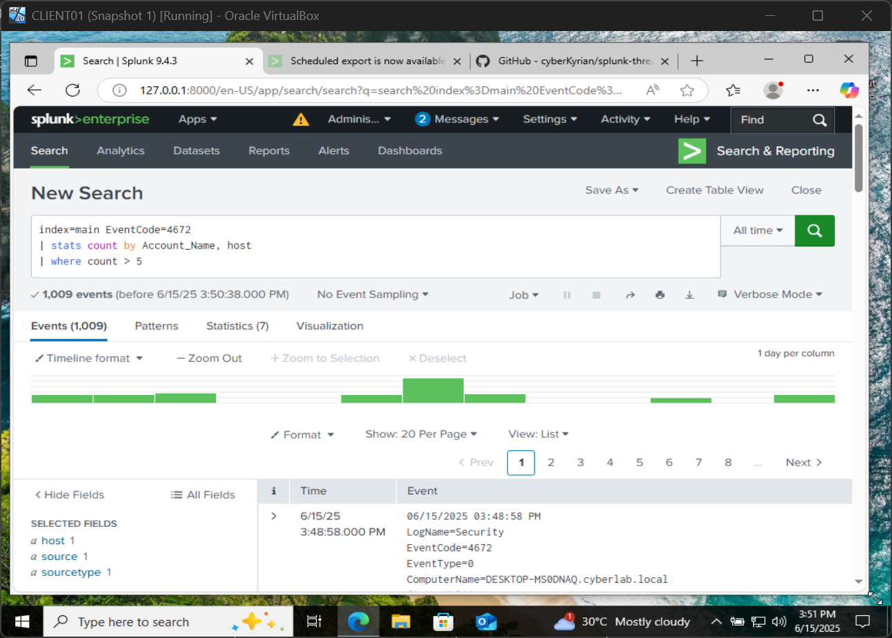
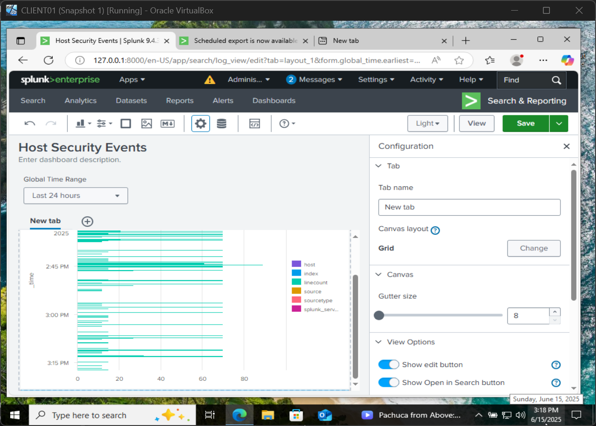

# Splunk Threat Hunting Lab: Detecting Anomalies in Enterprise Logs

### Author: Kyrian Onyeagusi
🔗 [LinkedIn](https://www.linkedin.com/in/kyrian-onyeagusi/) | 📧 [Email](mailto:kyrianoc18@gmail.com)

### Focus: Practical Threat Hunting with Splunk Using Custom Log Queries & Dashboards

---

## Lab Summary

This project demonstrates how to detect threats in enterprise environments using **Splunk**, one of the most widely adopted SIEM platforms in the world. I installed Splunk in a virtual lab environment, ingested simulated event data, and performed searches to identify anomalies like brute-force attacks, suspicious logons, and privilege abuse.

Splunk’s powerful query language (SPL) and visualization capabilities were used to build dashboards and perform live hunts, mimicking what analysts in SOCs do every day.

---

## Tools & Skills Demonstrated

* Splunk Enterprise 
* Data ingestion via Universal Forwarder / Local files
* Security-focused log parsing & filtering
* SPL (Search Processing Language)
* Alerting on suspicious login patterns
* Custom dashboards and reports

---

## Environment Setup

* **Splunk Enterprise** installed locally on Windows 10 VM
* Web interface accessed via `127.0.0.1:8000`
* Sample logs: Windows Security Event logs and synthetic logs
* Dashboards built inside Splunk UI

> ✅ Screenshot: Splunk dashboard homepage
> 
> ✅ Screenshot: Log source configuration interface
> 

---

## Threat Hunting Queries & Scenarios

### Brute Force Login Detection

```spl
index=win_logs sourcetype=WinEventLog:Security EventCode=4625
| stats count by Account_Name, src_ip
| where count > 10
```

> ✅ Screenshot: Table showing repeated failed logins from one IP
> 

---

### Suspicious Admin Logon Times

```spl
index=win_logs sourcetype=WinEventLog:Security EventCode=4624
| eval Hour=strftime(_time, "%H")
| where Account_Name="Administrator" AND (Hour < 6 OR Hour > 20)
| stats count by Account_Name, src_ip, Hour
```

> ✅ Screenshot: Visual showing admin login outside business hours
> 

---

### Excessive Privilege Use

```spl
index=win_logs EventCode=4672
| stats count by Account_Name, host
| where count > 5
```

> ✅ Screenshot: Highlighted user with high privilege use frequency
> 

---

## Dashboards

Custom dashboards were created to:

* Visualize login anomalies by user/IP
* Monitor administrative activity
* Display time-based event patterns

> ✅ Screenshot: Dashboard layout showing interactive visualizations
> 

---

## Why This Project Stands Out

* Mirrors **real SOC workflows**: search, pivot, alert
* Uses industry-grade tooling (Splunk) in practical threat detection
* Shows **SPL proficiency** and analytical thinking
* Demonstrates log familiarity (Windows Event IDs, patterns)

---

## 📌 Conclusion

This lab helped reinforce hands-on threat hunting skills using Splunk and real-world log data. It reflects my ability to triage, investigate, and visualize security events — and shows I’m ready to contribute in a SIEM-driven environment.

---

## 🔗 Contact

**Kyrian Onyeagusi**
🔗 [LinkedIn](https://www.linkedin.com/in/kyrian-onyeagusi/) | 📧 [Email](mailto:kyrianoc18@gmail.com)
